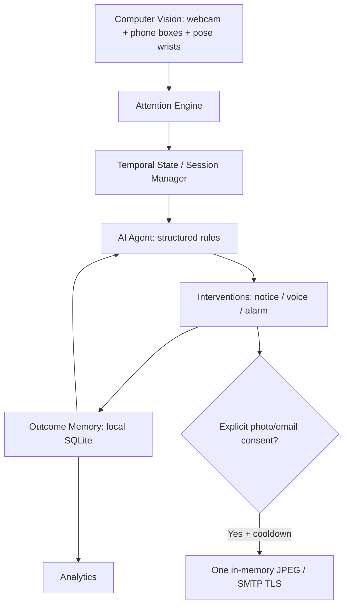

# Phone Attention Monitor

A local Python desktop productivity companion that notices sustained **apparent phone use**, tracks focus sessions, and nudges you back to work. Optional Parent Accountability Mode sends a single consented photo with a “College Investment Status Update.” It is disabled by default.

## Quick start — Windows / Python 3.11+

From this repository in PowerShell:

```powershell
python -m venv .venv
.\.venv\Scripts\python.exe -m pip install -r requirements-dev.txt
.\.venv\Scripts\python.exe app.py
```

For normal use, `requirements.txt` is sufficient; the development requirements also include pytest and Ruff. On macOS/Linux use `.venv/bin/python` instead. Linux may require your distribution's `python3-tk`, OpenGL libraries for OpenCV, and eSpeak for speech. Windows uses the built-in `winsound` alarm; other systems use a terminal bell whose audibility depends on terminal settings.

**Try the interface immediately without model downloads or a webcam:**

```powershell
python app.py --demo
```

Demo mode needs only Python with Tk, stores statistics in `data/demo.db`, never opens a camera, and cannot capture or email photos. In **Live Monitor**, select Focused, Phone use, Desk phone, Away, or Uncertain. Set a short threshold before starting if you want to try warning behavior. Audio is real in demo mode; disable it in Settings if desired.

The first real monitoring session loads/downloads `yolo11n.pt` and `yolo11n-pose.pt` through Ultralytics. Internet access is needed for installing dependencies and acquiring weights, then inference is local. For offline use, place those pretrained weights in `data/` before starting. These downloads do not upload webcam frames. Do not confuse pretrained model licensing with this application's source: review [Ultralytics licensing](https://www.ultralytics.com/license) before redistributing models or commercializing a derivative.

## What works

- Dark Tk dashboard, live annotated preview, analytics, and persistent settings.
- Webcam start/stop tied to focus sessions; visible camera status and graceful failure handling.
- YOLO phone detection plus YOLO pose wrist proximity to distinguish a desk phone from likely handling.
- Time-based smoothing, short dropout tolerance, glance/use distinction, and monotonic continuous timers.
- Configurable sustained-use threshold (60 seconds by default), warning cooldown, speech, alarm, and escalating repetitions.
- Named timed sessions, pause/resume, break/return, pickups, phone time, focus streaks, warnings, and automatic completion.
- SQLite session/event/intervention/email history; daily and rolling seven-day summaries and latest-session timeline.
- Structured deterministic agent, intervention response times, and basic historical personalization.
- Explicitly consented, single-image SMTP email with persistent cooldown; optional local retention.
- Camera-free demo, automated logic/adapter tests, and real Tk startup/control tests.

## Using the app

1. Enter your task, planned minutes, and phone threshold on **Dashboard**. Select **Start focus**.
2. Wait for model initialization and check **CAMERA MONITORING ACTIVE**. Look at **Live Monitor** to confirm phone boxes and wrist markers are plausible for your position.
3. Pause excludes elapsed time from the session. Break counts as session time but excludes focus/phone time and suppresses warnings. Camera preview continues during pause/break; **Stop** releases the webcam.
4. Monitoring ends at the planned session duration. A stalled/disconnected camera produces uncertainty, never assumed focus or an ongoing phone timer. Restart after addressing the camera problem.
5. Refresh **Analytics** to inspect saved results. Stop before saving **Settings** changes.

The phone timer begins when a phone and nearby wrist are observed. The first second is uncertain, the next two seconds are a glance, and sustained handling becomes PHONE_USE. Gaps of up to two seconds preserve an episode. Warnings occur **strictly after** the configured threshold, not at exactly 60 seconds. All thresholds live in `src/config.py`.

## Detection limitations

This is an understandable heuristic, not a validated attention or gaze measurement. Wrists are proxies for hands; a wrist near a phone does not prove use. It does not inspect the screen or infer actual thoughts. Small/occluded phones, camera angles, several people in view, and holding a phone without looking at it can cause errors. Use a single-person view and tune placement/thresholds. A visible phone without a nearby wrist is UNCERTAIN, not PHONE_USE. AWAY means no person was detected. FOCUSED means no phone-use evidence was found, not proof of concentration.

Smoothing adds latency and includes brief missing detections in continuous usage. Total phone time includes confirmed glance/use intervals but excludes the initial uncertain interval. Long processing gaps reset the continuous timer and are recorded as uncertain. These distinctions explain small differences between total and continuous phone timers.

## Optional parent email

Copy `.env.example` to `.env`, then supply:

```dotenv
USER_NAME=Student
PARENT_EMAIL=parent@example.com
SENDER_EMAIL=sender@example.com
EMAIL_APP_PASSWORD=your-provider-app-password
SMTP_HOST=smtp.gmail.com
SMTP_PORT=465
```

This implementation uses authenticated **SMTP over TLS (SMTP_SSL)**, typically port 465. It does not implement STARTTLS/port 587 or Gmail OAuth. Use an app password where your provider requires one; never commit it. Check your provider's current account requirements. An email is not sent merely by adding credentials.

In **Settings**, enter the recipient/name, enable **Parent Accountability Mode**, and save. The app requires confirmation of:

> Parent Accountability Mode will capture and email webcam photographs when sustained phone usage is detected. Only enable this if you understand and consent to this behavior.

You can edit the subject/body and cooldown. Supported body placeholders are `{USER_NAME}`, `{PHONE_DURATION}`, `{FOCUS_TIME}`, `{PHONE_PICKUPS}`, and `{WARNING_COUNT}`. Durations in email are seconds. Restart after changing `.env`; saved GUI preferences take precedence over initial environment defaults.

A qualifying intervention encodes one timestamped JPEG **in memory** and sends it as an attachment. There is no temporary image on disk to clean up. Only **Keep emailed photos locally** writes a copy to `data/evidence/` after a successful send. Attempts (including failed or interrupted sends) are persisted to enforce the default 30-minute cooldown across sessions/restarts. Email and speech use a serial background worker. The UI shows email failure without printing credentials. Queued/in-flight actions use the settings consented at trigger time; disabling mode prevents future triggers but cannot recall an already submitted email.

## Privacy and local data

- Default: local webcam processing, no video recording, no saved images, no image/cloud upload, email off.
- Behavioral statistics are stored locally in SQLite. Task names, dates, settings, and optional recipient information are personal data; files are not encrypted.
- The agent receives structured statistics, never images/video. No AI API or API key is required.
- Email mode explicitly transmits a photo to your configured provider/recipient; recipients and their providers may retain it.
- `.gitignore` excludes `.env`, local databases, settings, evidence, model weights, logs, and virtual environments.
- Close the app before deleting `data/attention.db` to erase real-session history; delete `data/demo.db` for demo history, `data/settings.json` for preferences, and `data/evidence/` for retained photos. Provider-side emails are separate.
- If this repository is inside OneDrive (as this workspace is), local data may be synced by OneDrive. Move the project outside synced folders if you want filesystem data to remain only on this computer.

## Architecture



```text
app.py                      CLI and desktop entry point
src/config.py               Preferences, consent copy, thresholds
src/camera.py               OpenCV webcam lifecycle
src/phone_detector.py       YOLO phone detections
src/hand_detector.py        YOLO pose wrists and proximity
src/monitor.py              Background inference, bounded newest-frame queue
src/attention_engine.py     States, smoothing, continuous timer
src/session_manager.py      Elapsed time, pickups, focus accounting
src/database.py             SQLite schema and persistence
src/ai_agent.py              observe / decide / act / observe_outcome policy
src/intervention_manager.py Warning cooldown, outcomes, worker, email gate
src/email_service.py        Credential-free-code SMTP adapter
src/screenshot_service.py   In-memory timestamped JPEG encoding
src/analytics.py             Summaries and historical statistics
ui/                         Dashboard, preview, timeline, settings
tests/                      Logic, adapters, privacy, GUI tests
data/                       Runtime-only state and optional model weights
```

Tk owns SQLite and all widgets. A camera thread performs inference and keeps only the latest frame. An output worker performs sound and SMTP without blocking normal GUI updates. Closing waits for submitted output work (SMTP has a 15-second socket timeout). Camera shutdown is cooperative; a blocked device/driver call may delay release, so restarting waits for the old worker.

Intervention response time is measured from each warning until confirmed FOCUSED state, including smoothing delay. Away/uncertain/break/pause leave outcomes unknown rather than falsely labeling a warning successful. Voice-only responses over 15 seconds cause the rule agent to choose more persistent alarms when alarms are enabled. Combined alarm+voice outcomes remain a separate category. Average focus block is an estimate; it divides session focus by pickups plus one. Daily event durations use local date boundaries; pickup/longest-streak aggregates use session start date, so sessions crossing midnight can appear under their start day for those metrics.

## Development and verification

```powershell
.\.venv\Scripts\python.exe -m pytest -q
.\.venv\Scripts\python.exe -m ruff check .
.\.venv\Scripts\python.exe -m compileall -q app.py src ui
.\.venv\Scripts\python.exe app.py --smoke-test
```

Tests use synthetic observations, in-memory SQLite, mocked camera/model/SMTP adapters, and an isolated demo GUI database. They never send real email or access a physical webcam. GUI tests skip when Tk cannot connect to a display. For a minimal test run with an existing Python/pytest environment, use `python -m pytest -q` (vision dependencies are imported lazily).

**Build-environment verification:** the GUI and camera-free tests were run in this workspace. Dependency installation from PyPI was attempted but the environment refused network connections; full real-camera/model inference, audible speech, and live SMTP delivery therefore still require a configured machine. See `VERIFICATION.md` for exact results. The project repository is https://github.com/Schicanes/phone-attention-monitor.

## Screenshots

Placeholder: add `docs/dashboard.png` and `docs/live-monitor.png` after running locally. Do not commit webcam photos without the pictured person's consent.

## Roadmap

- Full hand landmarks, head orientation, phone/wrist motion correlation, and calibrated per-person thresholds.
- Optional user-approved keyboard/mouse inactivity signals; no keystroke content collection.
- Richer focus-block learning, timezone-split session summaries, and retention controls.
- Replaceable LLM policy using structured statistics with tightly permissioned actions; never continuous webcam footage.
- Cross-platform packaged installers and bundled alarm audio; model/version compatibility CI.
- Notification, suggested-break, and focus-timer actions beyond the implemented warning policy.

Vision adapter references: [Ultralytics Python prediction results](https://docs.ultralytics.com/modes/predict/) and [pose task documentation](https://docs.ultralytics.com/tasks/pose/).
